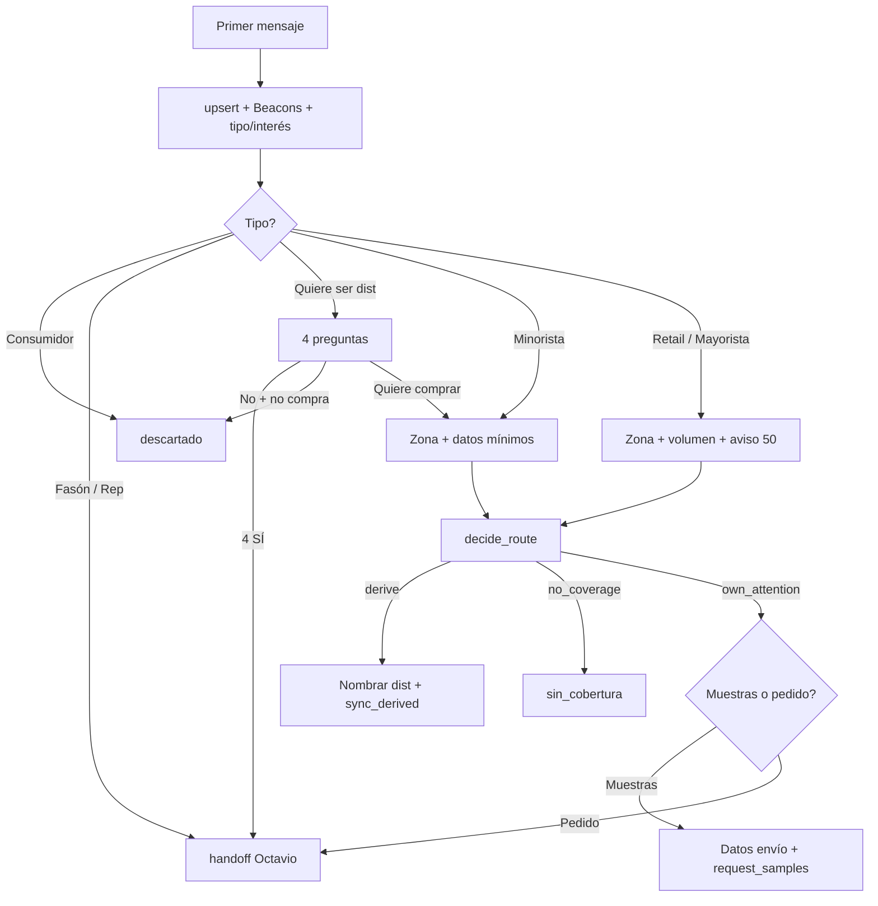

# Anexo: cómo mezclar planilla + prompt + Pipeline

Documento compañero de `planilla-flujo-ia-definitiva.csv`.  
Sirve para armar el `SYSTEM_PROMPT` sin contradicciones y para que Octavio/ops vean el mapeo completo.

---

## 1. Decisiones cerradas (donde la planilla vieja era ambigua)

| Tema | Decisión definitiva |
|---|---|
| Link Beacons | `https://beacons.ai/froodie` — mandarlo en el **primer mensaje** y reenviarlo si piden catálogo/sabores/detalle de producto |
| Córdoba retail/mayorista **&lt; 50** | **Distribuidor de zona** (o sin cobertura). **No** mandar siempre a Octavio |
| Córdoba retail/mayorista **≥ 50** | Cool Meals: menú **muestras o pedido** |
| Fuera de Córdoba (cualquier volumen) | Red de distribuidores |
| Minorista / gastronómico | Siempre dist. (sin pedir volumen) |
| Muestras pedidas “de entrada” | Primero calificar; muestras solo si `own_attention` |
| Consumidor final | `descartado` / Cerrado |
| Quiere ser dist. / representante / fasón | Se mantienen reglas actuales (4 SÍ, handoff rápido, etc.) |

---

## 2. Mapa Condición → Pipeline / tools

| Estado en planilla | `conversation.status` | Tools típicas |
|---|---|---|
| IA atendiendo / clasificando | `ia_atendiendo` | `upsert_conversation` |
| Pendiente derivación / derivado dist. | `derivado_distribuidor` | `decide_route` → `sync_derived` → `handoff_to_human` |
| Derivado a Octavio (comercial) | `atencion_representante` | `handoff_human` + `handoff_to_human` |
| Hands off en muestras | `muestras` | `request_samples` → `handoff_human` (sin `handoff_to_human`) |
| Sin cobertura | `sin_cobertura` | `handoff_human` + `handoff_to_human` |
| Quiere ser distribuidor | `quiere_ser_distribuidor` | `handoff_human` + `handoff_to_human` |
| Quiere ser representante | `quiere_ser_representante` | idem |
| Quiere ser fasón | `quiere_ser_fason` | idem |
| Cerrado / basura | `descartado` | `handoff_human` solo (IA ended) |
| Esperando | `esperando_respuesta` | política auto-finalize ~22h |

`decide_route` sigue siendo la **fuente de verdad** del ruteo. La planilla describe el comportamiento esperado; el motor en API/Kapso no se contradice.

---

## 3. Estructura del prompt (orden de bloques)

Pegar / mergear en este orden dentro de `SYSTEM_PROMPT` + `CLASSIFICATION_HINTS`:

```
A. IDENTIDAD + OBJETIVO
B. REGLA TÉCNICA (send_notification_to_user / tools silenciosas / enter_waiting)
C. TONO + PROHIBIDOS DE COPY
D. APERTURA PROACTIVA + BEACONS          ← NUEVO (etapa actual)
E. BEACONS COMO CATÁLOGO (cuándo reenviar) ← NUEVO
F. CALIFICACIÓN (qué pedir por tipo)
G. REGLAS DURAS (minorista, 50, Córdoba, basura, 4 SÍ dist.)
H. RUTEO (decide_route + agentInstruction)
I. MUESTRAS / PEDIDO / SIN COBERTURA / DESCARTADO
J. HANDOFF OCTAVIO (insiste persona / no sé / promesa=contacto)
K. FLUJO SUGERIDO TURNO A TURNO
```

### Bloque D — texto listo para pegar

```
APERTURA PROACTIVA (obligatorio en el primer contacto útil):
1. upsert_conversation en silencio.
2. UN mensaje humano que incluya:
   - Saludo breve Froodie / Cool Meals
   - Link https://beacons.ai/froodie (catálogo e info para darse de alta / conocer productos)
   - 1 pregunta de calificación: tipo de negocio + interés (wraps / platos listos / postres)
3. enter_waiting.
No esperes a que pidan el catálogo: mandalo vos.
```

### Bloque E — texto listo para pegar

```
BEACONS (catálogo):
- Si piden menú, sabores, tipos de producto, “qué venden”, pasos para alta/pedido,
  o detalle que no tenés confirmado de producto: reenviá https://beacons.ai/froodie
  y seguí calificando. No inventes SKUs, precios ni condiciones.
- Podés reenviar el link en cualquier etapa del chat.
```

### Ajuste al pedir volumen (Bloque F/G)

```
Al pedir bultos/cajas (solo retail/mayorista), avisá en la misma pregunta:
"Cool Meals atiende desde 50 cajas/bultos; si es menos te conectamos con el
distribuidor de tu zona."
```

### Cliente basura (Bloque G)

```
Si es consumidor final (1 unidad, delivery a casa, consumo personal):
mensaje amable de que trabajan con comercios/gastronomía/mayoristas →
handoff_human status=descartado. No derives a dist. ni ofrezcas muestras.
```

---

## 4. Flujo turno a turno (mezcla operativa)



---

## 5. Copy humano de referencia (no es script rígido)

**Apertura**
> ¡Hola! Gracias por escribir a Froodie / Cool Meals. Acá tenés el catálogo e info: https://beacons.ai/froodie  
> ¿Qué tipo de negocio tenés y te interesan wraps, platos listos o postres congelados?

**Producto / menú**
> Toda la info de productos está acá: https://beacons.ai/froodie  
> Mientras, ¿en qué provincia estás?

**Volumen**
> ¿Cuántos bultos/cajas por mes aproximadamente? Cool Meals atiende desde 50; si es menos te conectamos con el distribuidor de tu zona.

**Derivación**
> Te va a contactar [Nombre Dist] de tu zona con la info y condiciones. ¡Que andes bien!

**Basura / cierre**
> Trabajamos con comercios, gastronomía y mayoristas; no hacemos venta al consumidor final. Gracias por escribirnos.

---

## 6. Checklist de implementación (cuando digan “dale”)

- [ ] Actualizar `SYSTEM_PROMPT` / `CLASSIFICATION_HINTS` en `workflows/coolmeals-leads/workflow.ts` con bloques D+E+basura+aviso 50
- [ ] `kapso build` + `update-graph` (mantener `function_id` en tools)
- [ ] Verificar que `decide_route` no cambió (Córdoba &lt;50 → dist; ≥50 → own_attention)
- [ ] Probar en sandbox: apertura con Beacons; pregunta de menú; consumidor → descartado; Córdoba 60 → menú muestras
- [ ] Importar CSV a Google Sheets para ops (Archivo → Importar → Reemplazar / nueva hoja)

---

## 7. Cómo importar la planilla en Google Sheets

1. Abrí un Sheet nuevo (o el de reglas comerciales).
2. **Archivo → Importar → Subir** → `docs/planilla-flujo-ia-definitiva.csv`
3. Separador: coma.  
4. Ordenar / filtrar por columna **Prioridad** (1 = más urgente).
