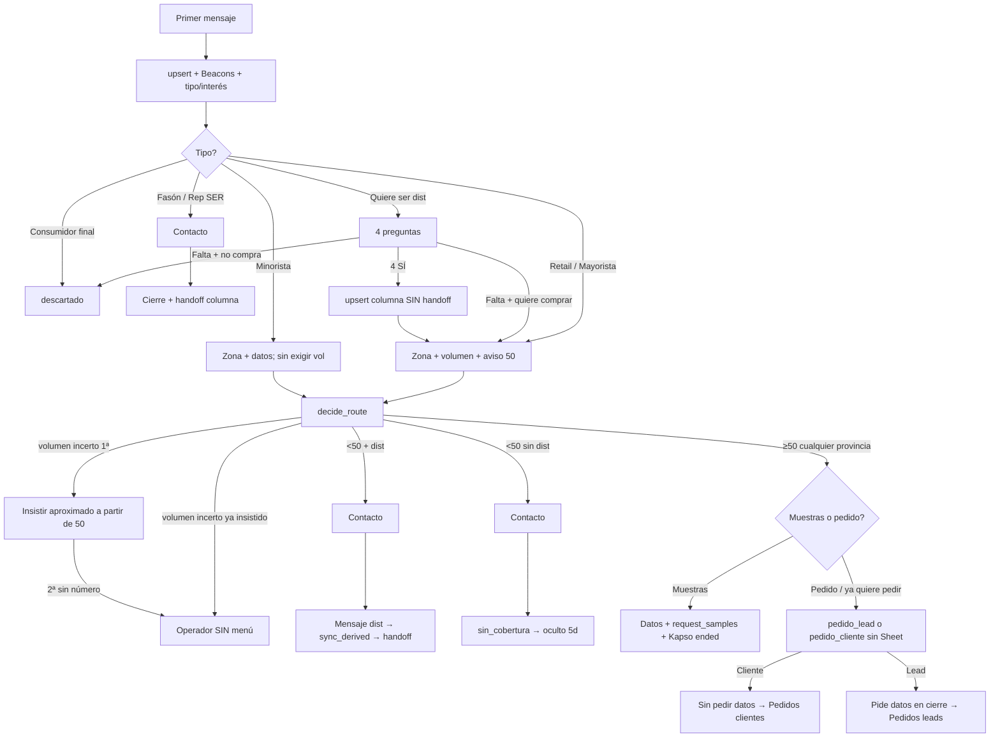

# Anexo: planilla + prompt + Pipeline

Compañero de [`planilla-flujo-ia-definitiva.csv`](./planilla-flujo-ia-definitiva.csv).  
Actualizado: **21 sep 2026** (Córdoba &lt;50 = dist/sin_cobertura; ≥50 Cool Meals; Pedidos lead/cliente sin Sheet; proveedor→Compras).

---

## 1. Decisiones cerradas (`decideRoute`)

Fuente de verdad: `apps/api/src/lib/routing.ts` **y** `functions/coolmeals-bot-actions/index.js` (mismas reglas). Gates de contacto / volumen: solo en la function Kapso + prompt.

| Tema | Decisión |
|---|---|
| Beacons | `https://beacons.ai/froodie` en el **primer mensaje** y si piden catálogo/sabores. **Sin precios**. Gate: `decide_route` exige `beaconsSent=true` (o link en chat/aiSummary) mientras status es `ia_atendiendo`/`nuevo` |
| Orden motor | 1) rep/fasón → 2) **≥50** → menú **o** Pedidos si ya quiere pedir → 3) **&lt;50** (cualquier provincia, incl. Córdoba) → dist / sin_cobertura si no hay gestión |
| Pedidos | `pedido_lead` / `pedido_cliente` + handoff. **Sin Sheet.** Cliente: skip contacto (WA). Lead: pide en cierre pero gate no bloquea |
| Minorista / gastronómico | Siempre `minorista`. No bloquear por volumen; si da ≥50 → menú |
| Muestras | Solo si `own_attention` **con** `coolMealsMenu` (≥50) **y** elección explícita (opción 1). `request_samples` exige `sampleChoiceConfirmed` + vol≥50. Gate bloquea &lt;50 / sin menú / derive / rep-fasón. Luego `handoff_human` `muestras` → **Kapso `ended`**. Card hasta Resultado |
| Unidades ↔ cajas | Si dio N viandas/wraps/unidades **sin** cajas/bultos → gate `volume_units_ambiguous`. Preguntar; luego `volumeUnitConfirmed=true` y volumen en **cajas** |
| Consumidor final | `descartado` (IA `ended`, **sin** `handoff_to_human`) |
| “Hablar con un representante” | `atencion_representante` — **no** `quiere_ser_representante` (gate remapea si confunde) |
| Quiere ser distribuidor | 4 SÍ → columna con `upsert` **sin handoff** → zona/volumen → `decide_route`. Nunca `handoff` con status `quiere_ser_distribuidor` |
| P3b compra vs ser dist | “tengo distribuidora / soy dist” sin aclarar → gate `distributor_intent_ambiguous`. Flags: `distributorIntentCleared` + `purchasePathConfirmed` o `distributorPathConfirmed` |
| Sticky dist → compra | Card en `quiere_ser_distribuidor` pero chat actual de compra → gate `sticky_distributor_purchase_recontact` |
| Volumen incerto / quiere precios | **1ª:** pregunta NORMAL de volumen (aviso **a partir de 50**). **Si dice no sé → 2ª:** asistente comercial de tu zona + ¿**a partir de 50** o **menos**?. Con orientación → `decide_route`. Si tampoco → operador. **"50 cajas" / "50 o 100"** cuenta como ≥50. Máx. 2 evasivas de precio; la 3ª → handoff real. **PROHIBIDO** inventar bultos |
| Contacto | Toda derivación/handoff comercial: `fullName` + `company` + `contactPhone` + `phoneConfirmed=true`. Si se niega: `contactRefused=true` → operador. No alcanza el perfil WA |
| Copy Córdoba | **PROHIBIDO** “asesor/distribuidor de la zona” cuando la provincia ya es Córdoba. **`sync_derived` bloqueado en Córdoba** (gate P5) |
| Derive | **Orden:** 1) mensaje humano  2) `sync_derived` con `deriveMessageSent=true`  3) `handoff_to_human`. Gate `derive_message_first` si falta el mensaje. `sync_derived` **no** corta Kapso. Sheet = **planilla de ese dist.** (`derived-distributor-sheets.ts`) |
| Promesa = handoff | Si prometés que un asesor contacta → mismo turno `handoff_human` + `handoff_to_human` (salvo muestras/descartado) |
| Pausa bot (humano) | Pipeline → **Atención humana** → `POST /bot/handoff`. **Fase E (parcial):** si el operador escribe desde **WhatsApp Business App**, Kapso manda `whatsapp.message.sent` con `origin=business_app` → `POST /api/webhooks/kapso` pausa el bot y mueve la card. **No** cubre respuestas desde Kapso Inbox (`cloud_api`, igual que el bot) |
| Desambiguación | Si **cualquier** dato/camino no está claro → **1 pregunta** antes de avanzar. Gate duro: `decide_route` / `request_samples` / `sync_derived` exigen `certainty=high`; si no, `needDisambiguation` |
| Auto-cierre | `sin_cobertura` ~**5 días** → card oculta + ended (**no** Descartado); mid-flujo (`nuevo`/`ia_atendiendo`) ~20h recontacto → ~24h Esperando → +24h **Descartado**. Derivado/Muestras/Atención/Quiere ser… = solo Resultado manual |
| Sheets | Derivados → 1 sheet por dist.; master viejo solo webhook; sandbox no escribe sheets |
| Teléfono canónico | `351…` / `54351…` / `549351…` = mismo lead (`54` + nacional, sin 9 móvil) |
| Recontacto mismo WA &lt;1 año (ya calificado, **no** muestras) | No tipificar de nuevo; no lead nuevo en métricas |
| Recontacto con card en **Muestras** | Tipifica de cero → **2ª card** (sin merge); la 1ª sigue en Muestras. Dashboard cuenta **solo la 1ª** |
| Recontacto ≥1 año | Nueva card + recalificar |
| Pipeline dup phone | UI: cards rojas + badge 1/2 (solo visual). KPIs: 1 teléfono = 1 lead (card más antigua) |
| Sandbox wipe | **Solo a pedido.** Auto-reset cada 20 min **apagado** |

---

## 2. Condición → Pipeline / tools

| Situación | `conversation.status` | Tools |
|---|---|---|
| Calificando | `ia_atendiendo` | `upsert_conversation` |
| ≥50 Cool Meals | `atencion_representante` **o** `pedido_*` / `muestras` | `decide_route` → menú **o** Pedidos si ya quiere pedir |
| Pedido lead | `pedido_lead` | `handoff_human` + `handoff_to_human` (sin Sheet; gate contacto no bloquea) |
| Pedido cliente | `pedido_cliente` | igual; skip contacto (alcanza WA) |
| Derivado | `derivado_distribuidor` | mensaje → `sync_derived` → `handoff_to_human` |
| Sin cobertura | `sin_cobertura` | contacto → `handoff_human` + `handoff_to_human` → auto oculto ~5d |
| Muestras Cool Meals | `muestras` | `request_samples` + `handoff_human` (IA **ended**; **no** `handoff_to_human`) |
| Quiere ser dist (4 SÍ) | `quiere_ser_distribuidor` | solo `upsert` (sin handoff) |
| Quiere ser rep / fasón | `quiere_ser_*` | contacto → `handoff_human` + `handoff_to_human` |
| Volumen incerto | `atencion_representante` | contacto → `handoff_human` (no `quiere_ser_distribuidor`) |
| Basura | `descartado` | solo `handoff_human` |
| Abandono | `esperando_respuesta` → `finalizado` | cron |

---

## 3. Flujo (mermaid)

---

## 4. Copy de referencia

**Apertura**  
> ¡Hola! Gracias por escribir a Froodie / Cool Meals. Catálogo e info: https://beacons.ai/froodie  
> ¿Qué tipo de negocio tenés y te interesan wraps, platos listos o postres congelados?

**Volumen (1ª pregunta — siempre esta primero)**  
> ¿Cuántos bultos/cajas por mes aproximadamente? Cool Meals atiende a partir de 50; si es menos te conectamos con el distribuidor de tu zona (o te avisamos si aún no hay cobertura).

**2ª insistencia — SOLO si dijo que no sabe**  
> Entiendo. Los precios, mínimos de compra y condiciones comerciales te los detalla un asistente comercial de tu zona. Para poder derivarte bien, ¿creés que serían a partir de 50 cajas al mes, o menos de 50? Con esa orientación alcanza.

**Sin orientar tampoco (tras la 2ª) → operador**  
> Perfecto. Un asesor Cool Meals te contacta para precios, mínimos y condiciones. ¿Este mismo número te sirve?

**Contacto**  
> ¿Me confirmás nombre completo, nombre del negocio y si este mismo número te sirve de contacto?

**Basura**  
> ¡Gracias por escribirnos! Hoy trabajamos con comercios, gastronomía y distribuidoras, así que no podemos ayudarte con compra personal ni envíos a domicilio. Cuando armes un negocio o una compra comercial, escribinos de nuevo. ¡Que andes muy bien!

---

## 5. Embalaje (dato confirmado)

| Producto | Unidades / caja | Palet |
|---|---|---|
| Wraps | 24 | 110 cajas |
| Platos listos | 12 | 110 cajas |
| Postres | 24 | 110 cajas |

---

## 6. UI web (agosto 2026)

Menú visible: Dashboard, Pipeline, Distribuidores, Config. comercial.  
Ocultos (código vivo): `/muestras`, `/conocimiento`, `/prompts`.

Producción: [web](https://tool-coolmeals-web.vercel.app) · [api](https://tool-coolmeals-api-ten.vercel.app) (team **FEcotech**). WhatsApp prod: `+54 9 351 549-5440`. Deploy por CLI (sin Git auto-deploy). Siempre `--project` (web vs API).  
Entornos DEV/PROD (local + sandbox vs Vercel): [`environments.md`](./environments.md).

---

## 7. Importar la planilla

1. Google Sheets → **Archivo → Importar → Subir** → `docs/planilla-flujo-ia-definitiva.csv`
2. Separador: coma  
3. Filtrar por columna **Seccion**: `ORDEN_EVALUACION` | `CASO_PRUEBA` | `AUTO_CIERRE` | `UI` | `EMBALAJE`
4. Ordenar por **Prioridad** (menor = más urgente / antes en el motor)
