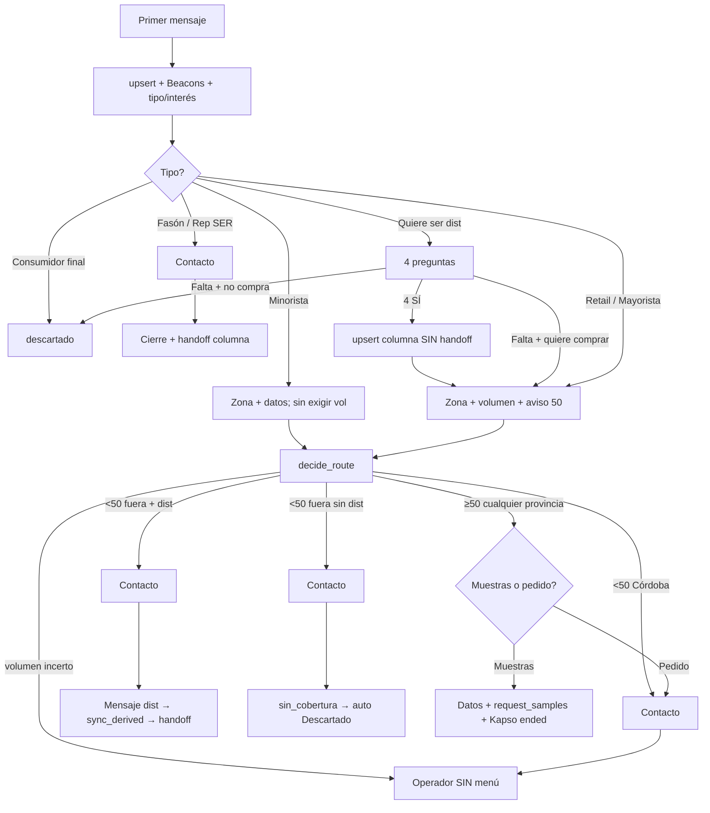

# Anexo: planilla + prompt + Pipeline

Compañero de [`planilla-flujo-ia-definitiva.csv`](./planilla-flujo-ia-definitiva.csv).  
Actualizado: **13 ago 2026** (contacto, volumen incerto, teléfonos canónicos, orden derive).

---

## 1. Decisiones cerradas (`decideRoute`)

Fuente de verdad: `apps/api/src/lib/routing.ts` **y** `functions/coolmeals-bot-actions/index.js` (mismas reglas). Gates de contacto / volumen: solo en la function Kapso + prompt.

| Tema | Decisión |
|---|---|
| Beacons | `https://beacons.ai/froodie` en el **primer mensaje** y si piden catálogo/sabores. **Sin precios** |
| Orden motor | 1) rep/fasón → 2) **≥50 cualquier provincia** → menú → 3) **Córdoba &lt;50** → operador sin menú → 4) fuera CBA &lt;50 → dist / sin_cobertura |
| Minorista / gastronómico | Siempre `minorista`. No bloquear por volumen; si da ≥50 → menú |
| Muestras | Solo si `own_attention` **con** `coolMealsMenu` (≥50). `request_samples` + `handoff_human` `muestras` → **Kapso `ended`** (sin `handoff_to_human`). Card queda hasta Resultado |
| Consumidor final | `descartado` (IA `ended`, **sin** `handoff_to_human`) |
| “Hablar con un representante” | `atencion_representante` — **no** `quiere_ser_representante` |
| Quiere ser distribuidor | 4 SÍ → columna con `upsert` **sin handoff** → zona/volumen → `decide_route`. Nunca `handoff` con status `quiere_ser_distribuidor` |
| Volumen incerto / quiere precios | Operador `atencion_representante`. **PROHIBIDO** inventar bultos bajos o rutear a dist/sin_cobertura |
| Contacto | Toda derivación/handoff comercial: `fullName` + `company` + `contactPhone` + `phoneConfirmed=true`. Si se niega: `contactRefused=true` → operador. No alcanza el perfil WA |
| Copy Córdoba | **PROHIBIDO** “asesor/distribuidor de la zona” cuando la provincia ya es Córdoba |
| Derive | **Orden:** 1) mensaje humano  2) `sync_derived`  3) `handoff_to_human`. `sync_derived` **no** corta Kapso |
| Desambiguación | Si **cualquier** dato/camino no está claro → **1 pregunta** antes de avanzar. Gate duro: `decide_route` / `request_samples` / `sync_derived` exigen `certainty=high`; si no, `needDisambiguation` |
| Auto-cierre | `sin_cobertura` ~22h → **Descartado**; `esperando_respuesta` ~22h → **Finalizado** |
| Teléfono canónico | `351…` / `54351…` / `549351…` = mismo lead (`54` + nacional, sin 9 móvil) |
| Recontacto mismo WA &lt;1 año (ya calificado, **no** muestras) | No tipificar de nuevo; no lead nuevo en métricas |
| Recontacto con card en **Muestras** | Tipifica de cero → **2ª card** (sin merge); la 1ª sigue en Muestras. Dashboard cuenta **solo la 1ª** |
| Recontacto ≥1 año | Nueva card + recalificar |
| Pipeline dup phone | UI: cards rojas + badge 1/2 (solo visual). KPIs: 1 teléfono = 1 lead (card más antigua) |
| Sandbox wipe | **Solo a pedido.** Auto-reset cada 20 min **apagado** |

---

## 2. Condición → Pipeline / tools

| Situación | `conversation.status` | Tools |
|---|---|---|
| Calificando | `ia_atendiendo` | `upsert_conversation` |
| ≥50 menú / operador CBA | `atencion_representante` (luego `muestras` si eligió) | `decide_route` → menú o handoff (tras contacto) |
| Derivado | `derivado_distribuidor` | mensaje → `sync_derived` → `handoff_to_human` |
| Sin cobertura | `sin_cobertura` | contacto → `handoff_human` + `handoff_to_human` → auto **Descartado** |
| Muestras Cool Meals | `muestras` | `request_samples` + `handoff_human` (IA **ended**; **no** `handoff_to_human`) |
| Quiere ser dist (4 SÍ) | `quiere_ser_distribuidor` | solo `upsert` (sin handoff) |
| Quiere ser rep / fasón | `quiere_ser_*` | contacto → `handoff_human` + `handoff_to_human` |
| Volumen incerto | `atencion_representante` | contacto → `handoff_human` (no `quiere_ser_distribuidor`) |
| Basura | `descartado` | solo `handoff_human` |
| Abandono | `esperando_respuesta` → `finalizado` | cron |

---

## 3. Flujo (mermaid)

---

## 4. Copy de referencia

**Apertura**  
> ¡Hola! Gracias por escribir a Froodie / Cool Meals. Catálogo e info: https://beacons.ai/froodie  
> ¿Qué tipo de negocio tenés y te interesan wraps, platos listos o postres congelados?

**Volumen (si ya es Córdoba)**  
> ¿Cuántos bultos/cajas por mes aproximadamente? Cool Meals atiende directo desde 50; si es menos te contacta un asesor Cool Meals.

**Volumen (si no es Córdoba / aún no hay zona)**  
> ¿Cuántos bultos/cajas por mes aproximadamente? Cool Meals atiende desde 50; si es menos te conectamos con el distribuidor de tu zona (o un asesor Cool Meals si estás en Córdoba).

**Contacto**  
> ¿Me confirmás nombre completo, nombre del negocio y si este mismo número te sirve de contacto?

**Basura**  
> ¡Gracias por escribirnos! Hoy trabajamos con comercios, gastronomía y distribuidoras, así que no podemos ayudarte con compra personal ni envíos a domicilio. Cuando armes un negocio o una compra comercial, escribinos de nuevo. ¡Que andes muy bien!

---

## 5. Embalaje (dato confirmado)

| Producto | Unidades / caja | Palet |
|---|---|---|
| Wraps | 24 | 110 cajas |
| Platos listos | 12 | 110 cajas |
| Postres | 24 | 110 cajas |

---

## 6. UI web (agosto 2026)

Menú visible: Dashboard, Pipeline, Distribuidores, Config. comercial.  
Ocultos (código vivo): `/muestras`, `/conocimiento`, `/prompts`.

Producción: [web](https://tool-coolmeals-web.vercel.app) · [api](https://tool-coolmeals-api-ten.vercel.app) (team **FEcotech**). Deploy por CLI (sin Git auto-deploy). Siempre `--project` (web vs API).

---

## 7. Importar la planilla

1. Google Sheets → **Archivo → Importar → Subir** → `docs/planilla-flujo-ia-definitiva.csv`
2. Separador: coma  
3. Filtrar por columna **Seccion**: `ORDEN_EVALUACION` | `CASO_PRUEBA` | `AUTO_CIERRE` | `UI` | `EMBALAJE`
4. Ordenar por **Prioridad** (menor = más urgente / antes en el motor)
